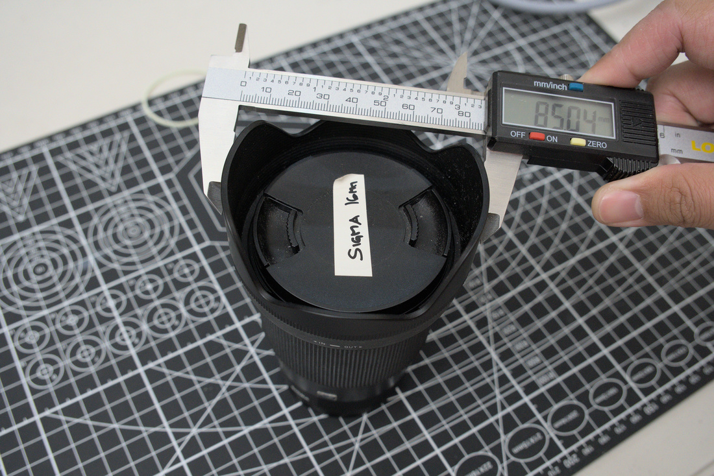
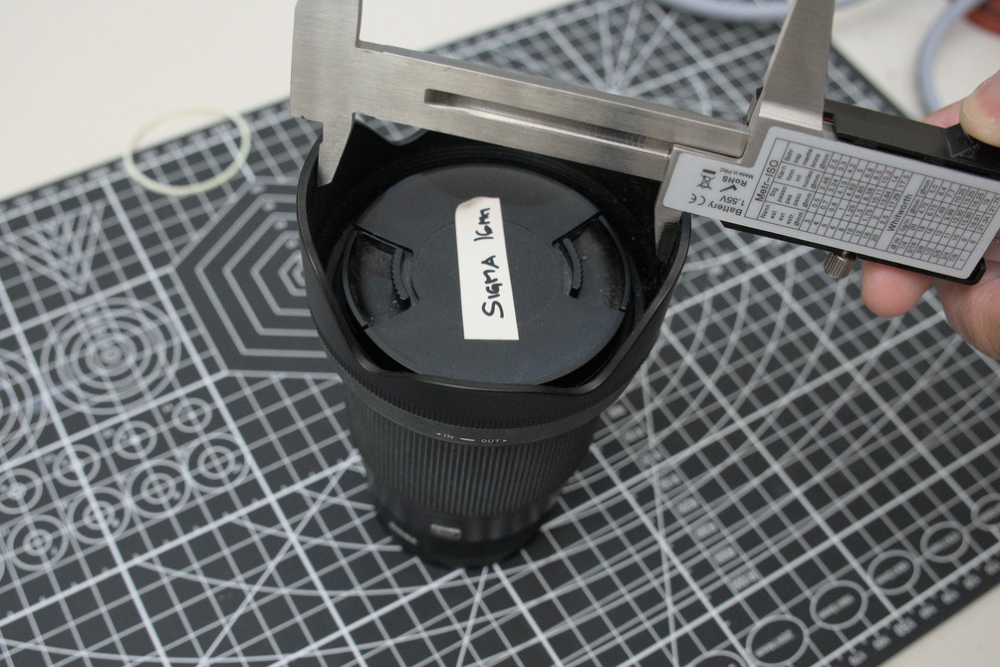
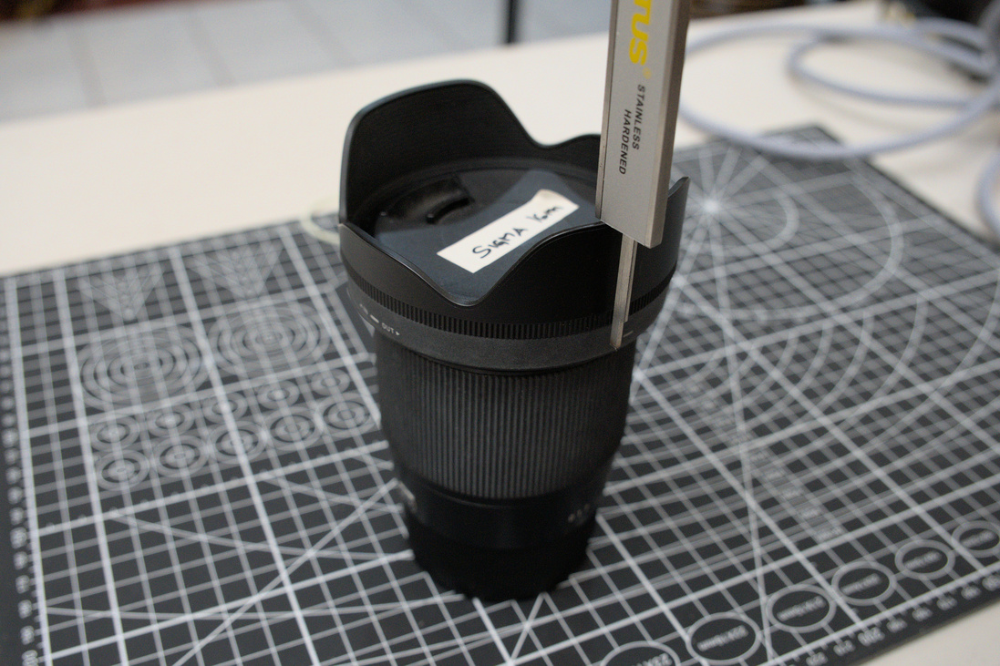

# Lens Cover

A 3D printable cup-style lens cover designed to go over a lens hood. OpenSCAD files are parametric so you should be able to make one for your own specific lenses.

Set the following variables (example from Sigma_16mm_DC_DN.scad):
```
DIA_EXT = 85.5; // External diameter of the lens
DIA_INT = 74; // Internal diameter of the lens
CAP_HEIGHT = 25;
```

### DIA_EXT
The external diameter of the lens hood. Measure the widest point.



### DIA_INT
The internal diameter of the lens hood. Measure the narrowest point.


### CAP_HEIGHT
The from the front of the lense up to your prefered depth of the cap.

